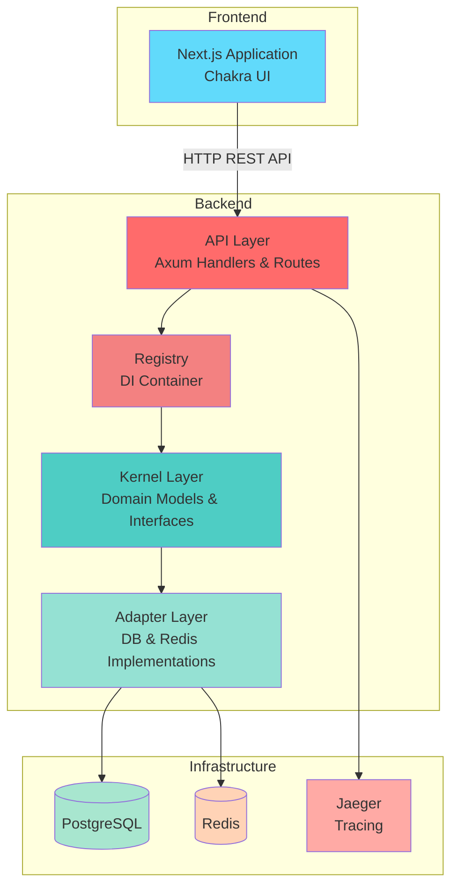

# Rusty Book Manager

Rustで構築された蔵書管理Webアプリケーションです。クリーンアーキテクチャの原則に基づいて設計されており、書籍の管理、ユーザー認証、貸出管理などの機能を提供します。

## 📚 概要

このプロジェクトは、書籍管理システムの実装を通じてRustでのWeb開発を学ぶための教材として作成されています。モダンなWebアプリケーション開発に必要な要素（RESTful API、データベース連携、認証、キャッシング、フロントエンド統合など）を網羅的にカバーしています。

## 🏗️ アーキテクチャ

本プロジェクトは、クリーンアーキテクチャに基づいた階層化されたアーキテクチャを採用しています。

### システム構成図



### レイヤー構成

```
┌─────────────────────────────────────────────────┐
│              Frontend (Next.js)                 │
│  - React Components with Chakra UI              │
│  - API Client (SWR)                             │
└─────────────────────────────────────────────────┘
                      ↓ HTTP
┌─────────────────────────────────────────────────┐
│           API Layer (api)                       │
│  - HTTP Handlers                                │
│  - Request/Response Models                      │
│  - Validation (Garde)                           │
│  - Routes & Extractors                          │
└─────────────────────────────────────────────────┘
                      ↓
┌─────────────────────────────────────────────────┐
│         Kernel Layer (kernel)                   │
│  - Domain Models (Book, User, Checkout)         │
│  - Repository Traits                            │
│  - Business Logic Interfaces                    │
└─────────────────────────────────────────────────┘
                      ↓
┌─────────────────────────────────────────────────┐
│         Adapter Layer (adapter)                 │
│  - PostgreSQL Repository Implementations        │
│  - Redis Cache Implementation                   │
│  - Authentication Service                       │
└─────────────────────────────────────────────────┘
                      ↓
┌─────────────────────────────────────────────────┐
│           Infrastructure                        │
│  - PostgreSQL Database                          │
│  - Redis Cache                                  │
│  - Jaeger Tracing                               │
└─────────────────────────────────────────────────┘
```

### 依存関係の流れ

```
Registry ──> Adapter ──> Kernel ──> Shared
   ↓            ↓
   └────> API ──┘
```

## 🛠️ 技術スタック

### バックエンド
- **言語**: Rust (Edition 2024)
- **Webフレームワーク**: Axum 0.7
- **データベース**: PostgreSQL + SQLx
- **キャッシュ**: Redis
- **認証**: bcrypt
- **バリデーション**: Garde
- **トレーシング**: OpenTelemetry + Jaeger
- **API仕様**: OpenAPI (utoipa)

### フロントエンド
- **フレームワーク**: Next.js 14
- **UI ライブラリ**: Chakra UI
- **状態管理**: SWR
- **フォーム**: React Hook Form
- **言語**: TypeScript

### インフラストラクチャ
- **コンテナ**: Docker / Docker Compose
- **データベース**: PostgreSQL 15
- **キャッシュ**: Redis Alpine

## 📁 プロジェクト構成

```
.
├── adapter/          # インフラストラクチャ層の実装
│   ├── database/     # PostgreSQL リポジトリ実装
│   ├── redis/        # Redis クライアント実装
│   └── migrations/   # データベースマイグレーション
├── api/              # プレゼンテーション層
│   ├── handler/      # HTTPハンドラー
│   ├── model/        # リクエスト/レスポンスモデル
│   └── route/        # ルート定義
├── kernel/           # ドメイン層
│   ├── model/        # ドメインモデル（Book, User, Checkout等）
│   └── repository/   # リポジトリトレイト定義
├── registry/         # 依存性注入コンテナ
├── shared/           # 共有ユーティリティ
│   ├── config/       # 設定管理
│   └── error/        # エラー型定義
├── frontend/         # Next.js フロントエンド
│   ├── app/          # App Router
│   └── public/       # 静的ファイル
└── src/              # アプリケーションエントリーポイント
    └── bin/app.rs    # メインアプリケーション
```

## 🚀 セットアップ

### 必要要件

- Rust 1.75+ (Edition 2024対応)
- Docker & Docker Compose
- Node.js 18+ (フロントエンド開発用)
- PostgreSQL 15
- Redis

### 環境変数の設定

プロジェクトルートに `.env` ファイルを作成します：

```bash
# Server
HOST=0.0.0.0
PORT=8080

# Database
DATABASE_HOST=postgres
DATABASE_PORT=5432
DATABASE_PORT_OUTER=5432
DATABASE_PORT_INNER=5432
DATABASE_USERNAME=postgres
DATABASE_PASSWORD=postgres
DATABASE_NAME=bookmanager

# Redis
REDIS_HOST=redis
REDIS_PORT=6379
REDIS_PORT_OUTER=6379
REDIS_PORT_INNER=6379

# Auth
AUTH_TOKEN_TTL=3600

# Tracing
JAEGER_HOST=jaeger
JAEGER_PORT=6831
```

### Docker Composeでの起動

最も簡単な方法は、Docker Composeを使用してすべてのサービスを一度に起動することです：

```bash
docker compose up -d
```

これにより以下のサービスが起動します：
- バックエンドAPI (ポート 8080)
- PostgreSQL (ポート 5432)
- Redis (ポート 6379)

### ローカル開発環境での起動

#### バックエンド

1. データベースとRedisを起動：
```bash
docker compose up -d postgres redis
```

2. データベースのマイグレーション実行：
```bash
cargo install sqlx-cli --no-default-features --features postgres
sqlx migrate run
```

3. バックエンドサーバーを起動：
```bash
cargo run --bin app
```

サーバーは `http://localhost:8080` で起動します。

#### フロントエンド

1. フロントエンドディレクトリに移動：
```bash
cd frontend
```

2. 依存関係のインストール：
```bash
npm install
```

3. 環境変数の設定（`frontend/.env.local`）：
```bash
NEXT_PUBLIC_API_URL=http://localhost:8080
```

4. 開発サーバーを起動：
```bash
npm run dev
```

フロントエンドは `http://localhost:3000` で起動します。

詳細なフロントエンドのセットアップ方法は [frontend/README.md](./frontend/README.md) を参照してください。

## 📖 API仕様

APIサーバーを起動後、以下のURLでAPI仕様を確認できます：

- Redoc: `http://localhost:8080/redoc`
- OpenAPI JSON: `http://localhost:8080/openapi.json`

### 主要エンドポイント

- **認証**
  - `POST /auth/login` - ログイン
  - `POST /auth/logout` - ログアウト

- **書籍管理**
  - `GET /v1/books` - 書籍一覧取得
  - `POST /v1/books` - 書籍登録
  - `GET /v1/books/{id}` - 書籍詳細取得
  - `PUT /v1/books/{id}` - 書籍更新
  - `DELETE /v1/books/{id}` - 書籍削除

- **ユーザー管理**
  - `GET /v1/users` - ユーザー一覧取得
  - `POST /v1/users` - ユーザー登録
  - `PUT /v1/users/{id}` - ユーザー更新
  - `DELETE /v1/users/{id}` - ユーザー削除

- **貸出管理**
  - `GET /v1/checkouts` - 貸出一覧取得
  - `POST /v1/checkouts` - 書籍の貸出
  - `POST /v1/checkouts/{id}/return` - 書籍の返却

- **ヘルスチェック**
  - `GET /health` - サーバーヘルスチェック

## 🔧 開発

### ビルド

```bash
cargo build
```

### テスト実行

```bash
cargo test
```

### リント

```bash
cargo clippy
```

### フォーマット

```bash
cargo fmt
```

## 🏛️ 設計原則

### クリーンアーキテクチャ

本プロジェクトは、以下のクリーンアーキテクチャの原則に従っています：

1. **依存関係の逆転**: 外側のレイヤーは内側のレイヤーに依存しますが、その逆はありません
2. **関心の分離**: 各レイヤーは明確に定義された責務を持ちます
3. **テスタビリティ**: トレイトを使用することで、モックを用いた単体テストが容易です

### レイヤーの責務

- **API Layer**: HTTPリクエスト/レスポンスの処理、バリデーション
- **Kernel Layer**: ビジネスロジック、ドメインモデル、リポジトリインターフェース定義
- **Adapter Layer**: 外部システム（データベース、キャッシュ）との連携実装
- **Registry**: 依存性の注入と管理
- **Shared**: 層を跨いで使用される共通の型やユーティリティ

## 📝 ライセンス

MIT License

## 🤝 コントリビューション

このプロジェクトは学習教材として作成されています。Issue や Pull Request は歓迎します！

## 📚 関連リソース

- [Rust公式ドキュメント](https://www.rust-lang.org/)
- [Axum Documentation](https://docs.rs/axum/latest/axum/)
- [Next.js Documentation](https://nextjs.org/docs)
- [SQLx Documentation](https://docs.rs/sqlx/latest/sqlx/)
